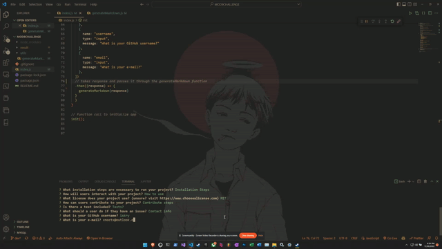

# readMeGenerator
 
## Description  
A node.js application that takes user input to populate a README.md file. The generated README.md file is created in the result directory. 

## Table of Contents
- [Description](#description)
- [Installation](#installation)
- [Usage](#usage)
- [License](#license)
- [Contributing](#contributing)
- [Tests](#tests)
- [Questions](#questions)
## Installation  
>npm init  
>npm install inquirer
## Usage
Run the following command in the root directory and answer the questions prompted:   
>node index.js

Video of usage can be found [here](/media/READMEgen.webm)
## License
 
MIT
## Contributing
Pull requests are welcome. For major changes, please open an issue first to discuss what you would like to change.
## Tests
N/A
## Questions
Contact me at the following  

Any questions? 

###### [GitHub](https://github.com/test)  
###### [Email](https://github.com/test) 
  